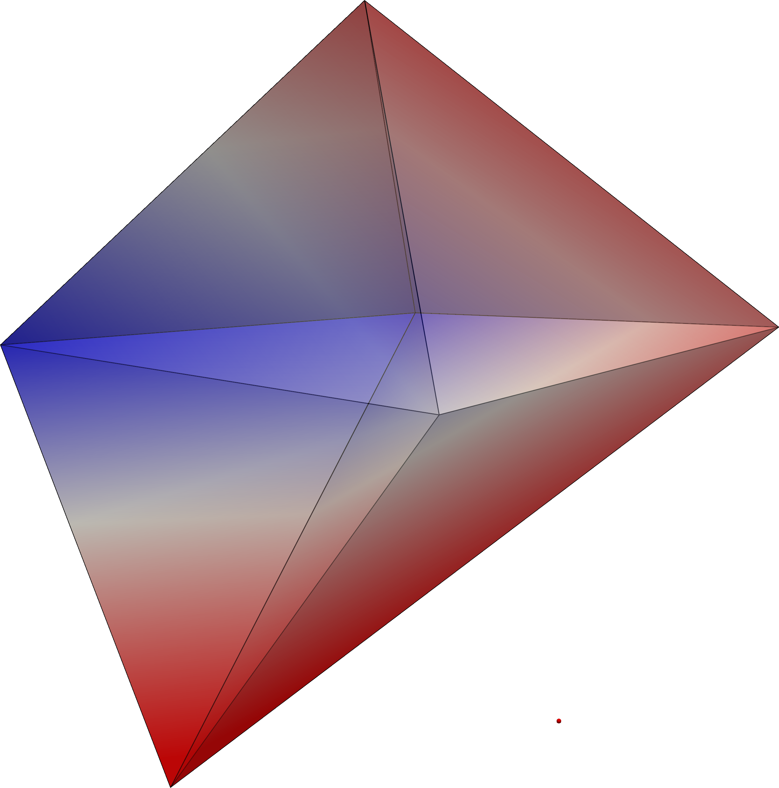
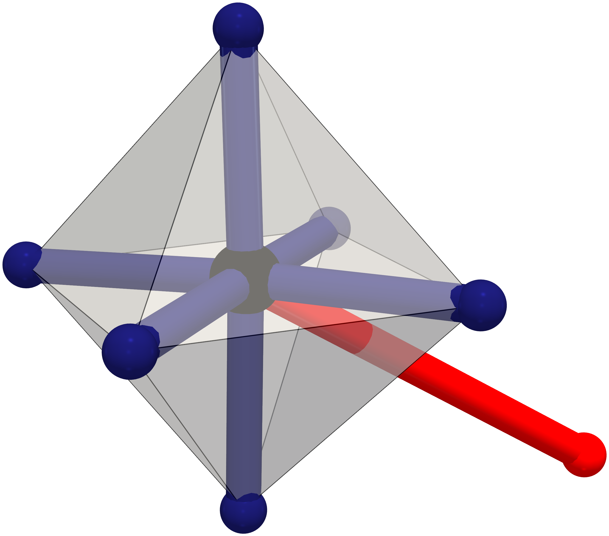

# solvis


## About

Various ways to analyze and visualize solvation shell structures, which wraps [`PyVista`](https://docs.pyvista.org/version/stable/). Meant primarily for analyzing the outputs produced by LAMMPS here. 

## Installation

We use [`micromamba`](https://mamba.readthedocs.io/en/latest/user_guide/micromamba.html) as the package manager, but feel free to use your own poison. Create and activate the environment. 

```bash
micromamba create -f environment.yml
micromamba activate solvisenv
```

In order to install the code, run the following:

```bash
inv build # flit build
inv build --install
```

## Examples 

Each example is self-contained. Go into the example directory and run the script. The inputs are short LAMMPS dump files inside the top-level `resources` directory.  

- *single_sphericity_calc*: This calculates the sphericity for a convex hull constructed from the six nearest neighbours of an Fe atom. The input trajectory file has a single frame, containing only 7 oxygen atoms and 1 Fe atom in the LAMMPS dump text format, with atom types of 1 and 3, respectively. The sphericity is calculated by first finding the six nearest neighbours using k-nearest neighbours, constructing the convex hull using the `ConvexHull` function from `SciPy` (that wraps `Qhull`), and getting the enclosed volume and surface area. Visualization is done in `PyVista`, such that the surface is coloured according to the distance from the central Fe atom. The point corresponding to the seventh furthest molecule is also plotted. The configuration corresponds to a capped trigonal prism geometry. 

- *sphericity_calc_traj*: Calculation of sphericity values for a convex hull surrounding each Fe ion, starting from a LAMMPS trajectory file with multiple frames. The coordination number within a cutoff is also calculated. The system has O,H,Fe, and Cl atoms with atom types 1, 2, 3,4, respectively. A text output file is written out containing sphericity values. This script will work even if there are multiple ion centers in the trajectory file. WARNING: However, this script will fail if a trajectory has only one frame.

## Image Gallery




