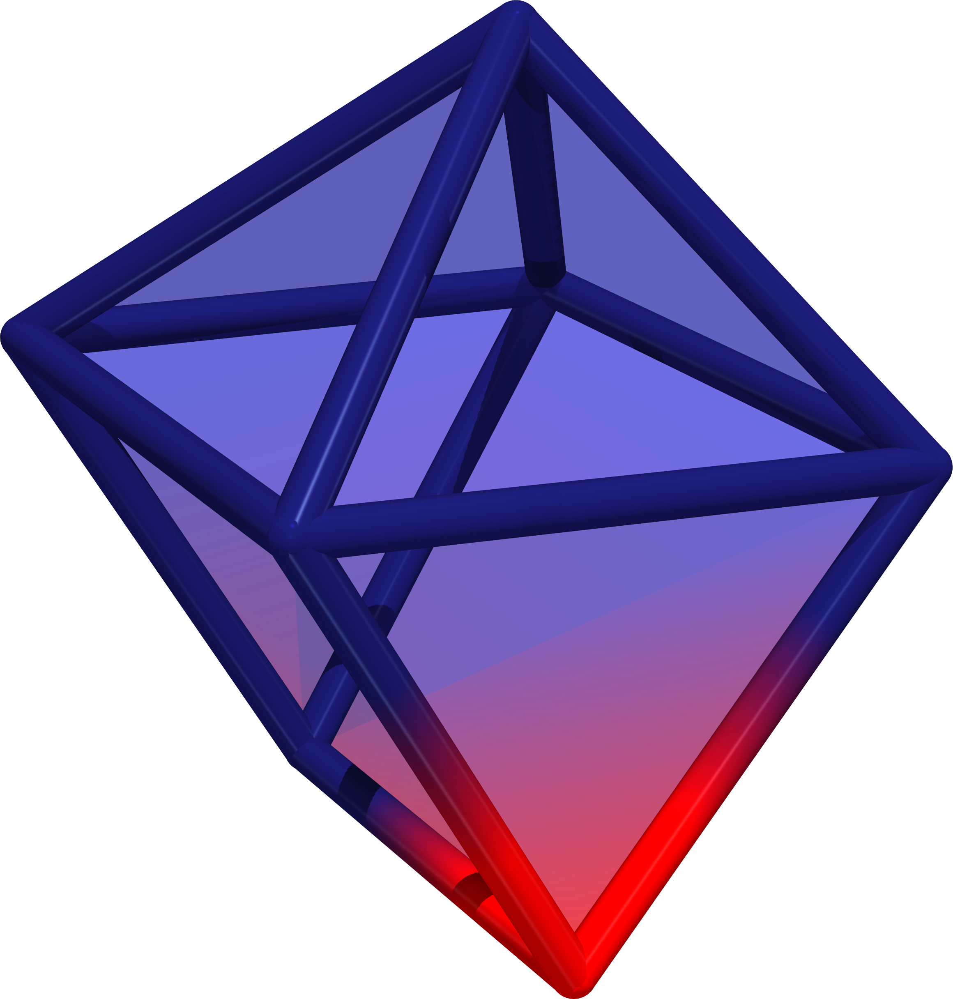

# solvis


## About

Various ways to analyze and visualize solvation shell structures, which wraps [`PyVista`](https://docs.pyvista.org/version/stable/). Meant primarily for analyzing the outputs produced by LAMMPS here. 

## Installation

We use [`micromamba`](https://mamba.readthedocs.io/en/latest/user_guide/micromamba.html) as the package manager, but feel free to use your own poison. Create and activate the environment. 

```bash
micromamba create -f environment.yml
micromamba activate solvisenv
```

In order to install the code, run the following in the top-level directory:

```bash
pip install -e .
```

## Examples 

Each example is self-contained. Go into the example directory and run the script. The inputs are short LAMMPS dump files inside the top-level `resources` directory.  

## Tests

To run tests (which are inside the `tests` directory), written with `pytest`, run the following command from the top-level directory: 

```bash
pytest -v
```

In order to debug tests using `pdb`, you can write the command `breakpoint()` inside the `Python` files (in `tests`) wherever you want to set a breakpoint. Then, run `pytest --pdb`. This will stop the code at the line where you put the `breakpoint()` command. 

To see more verbose output from `pytest`, including tests that pass, you can run `pytest -rA`.

## Image Gallery




